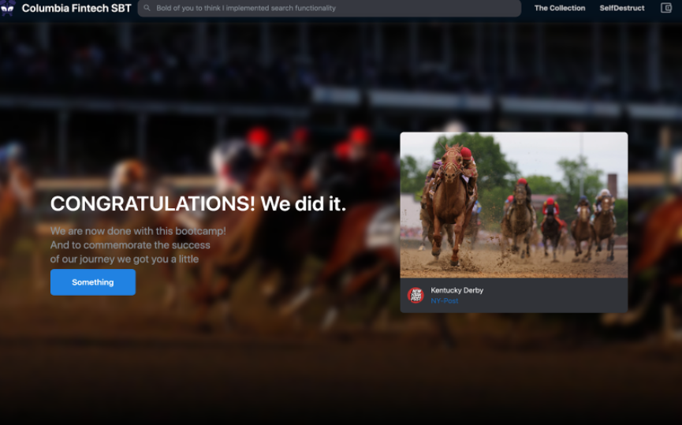

# Soulbound Token-Columbia-2022

## The problem
*We are all Winners (SBT) looks to connect all the graduates from Columbia Fintech Bootcamp through a NFT that is not transferable acting as an informal certificate of completion bonding all the graduate*


**What are Soulbound Tokens (SBTs)?**

*Soulbound Tokens are NFT's that act like real-life achievement badges. Vitalik Buterin envisions them as a way to prove your employment history, education, and other IRL skills*

**How do Soulbound Tokens work?**

*Soulbound Tokens are essentially your resume on the blockchain. The institution granting you the token will be the only one that can issue a SBT*

---

## Technologies

Python
```
    Streamlit
    Web3
    Style.css
```

Solidty
```
    Openzepellin for standar ERC721
    IPS for data storage
    Ganache for creating a local blockchain for testing
```
Thirdweb
```
    SDK Marketplace
    Alchemy for provider
```

## Screenshoots

The following screenshoots are an example of the dApp

*Demo*
